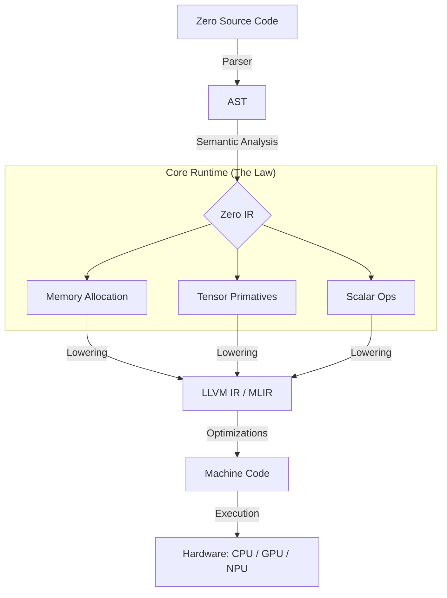

  

<h1 align="center">Zero — Core Runtime</h1>

  <strong>The Immutable Substrate for High-Performance ML.</strong> 

---

## 🏗️ Why an Isolated Core-Runtime?

Zero treats the **Core Runtime** as a sacred, isolated layer. This isolation is a deliberate engineering choice driven by three factors:

1.  **Elimination of Dependency Bleed:** Most languages fail because their core is tightly coupled with their standard library or backend (like LLVM). By isolating the core, we ensure that changes in high-level ML logic or LLVM updates never break the fundamental "laws" of Zero.
2.  **Zero-Overhead Principle:** Because the core is written in pure C++ and contains no high-level abstractions (no dictionaries, no heavy objects), there is no "runtime tax." You pay only for the machine instructions your code actually needs.
3.  **Auditable Determinism:** A small, frozen core is easier to verify. For ML workloads where numerical stability is everything, having a deterministic execution layer is non-negotiable.

---

## 🌊 Execution Flow

The following diagram illustrates how Zero code travels from high-level syntax to raw machine execution through the Core Runtime:

---

## 🔮 Future Potential

The Core Runtime is designed not just for today's hardware, but for the next decade of compute:

*   **Backend Agnosticism:** While we currently target **LLVM**, the isolated nature of Zero IR means we can easily add backends for **MLIR**, **Cuda PTX**, or direct **NPU ISA** without rewriting the language.
*   **Embeddability:** Because the Core is a minimal C++ substrate, it can be embedded into other systems (Games, Browsers, Edge Devices) as a high-performance, lightweight ML execution engine.
*   **Self-Hosting Evolution:** As the Core stabilizes, it provides the foundation for Zero to "write itself." Eventually, the most complex parts of the compiler will be written in Zero, running on top of this very Core Runtime.

---

## 🔒 The Frozen Core Commitment

The Core Runtime follows a **"Freeze Early"** policy. We believe a language is only as stable as its lowest layer. Once the fundamental primitives for memory and tensor handling are verified, this repository will enter a "frozen" state—where updates are rare, highly scrutinized, and focused exclusively on performance and stability.

---

  <em>"If it can be implemented in Zero, it does not belong in the Core."</em>

